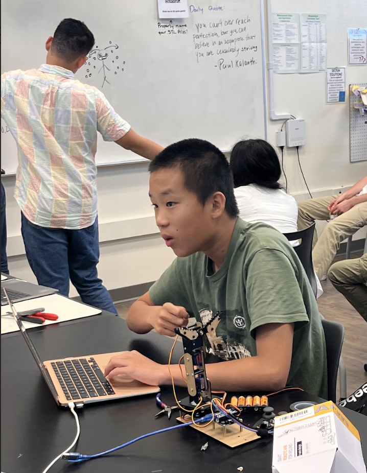
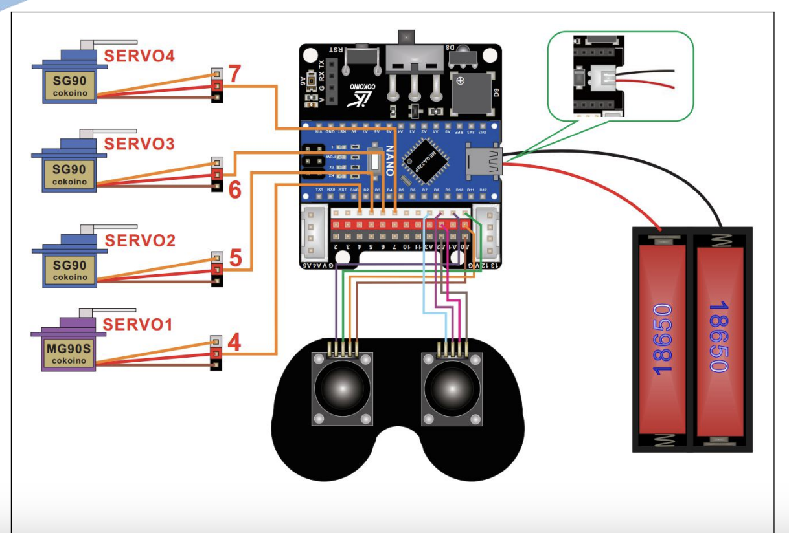

# BlueStamp Robotics Arm
This project is related to the robotic arm.

| **Engineer** | **School** | **Area of Interest** | **Grade** |
|:--:|:--:|:--:|:--:|
|Nathan G| The Kings Academy| Electrical Engineering | Incoming 8th Grader




# Modification
<iframe width="560" height="315" src="https://www.youtube.com/embed/TqhfUfL7_9Y?si=Fgm_4zawmFOwmDGQ" title="YouTube video player" frameborder="0" allow="accelerometer; autoplay; clipboard-write; encrypted-media; gyroscope; picture-in-picture; web-share" referrerpolicy="strict-origin-when-cross-origin" allowfullscreen></iframe>

For my modification, I added a simple LED light which is connected by wires on a bredboard. This is a small modification and when the robot is turned on, the LEDs light up. I did this because I wanted to connect the starter project which was the LED sliders to my final project, the robotic arm. When the arm is turned on, the light shines blue, and it does this because a reactor is connected between both sides of the bredboard. This is powered through the nanoboard. A challenge that I experienced in this was not connecting the wires in the right area.


# Final Milestone

**Don't forget to replace the text below with the embedding for your milestone video. Go to Youtube, click Share -> Embed, and copy and paste the code to replace what's below.**

<iframe width="560" height="315" src="https://www.youtube.com/embed/HyrRUpX5CV8?si=b-tCAKkckB787-Vh" title="YouTube video player" frameborder="0" allow="accelerometer; autoplay; clipboard-write; encrypted-media; gyroscope; picture-in-picture; web-share" referrerpolicy="strict-origin-when-cross-origin" allowfullscreen></iframe>


In my final milestone, I was supposed to code and made sure all my code works. Thanks to Ben, I finished my all my work and finished programming. In programming, I first set it to servo Servo1, servo Servo2, all the way to servo Servo4. this defined the servo, and then we created a joystick function and then plugged it in. Then, we set the servo to different degrees based on the serial monitor and plug it in. Doing this allows the joystick to control the the different parts based on the serial monitor. This was challenging due to the code being different than the given code on the Github site, and Ben and I had to make a new code ourselves. We still have time for a short modification, and could get it done by Thursday, before Demo night.


# Second Milestone

**Don't forget to replace the text below with the embedding for your milestone video. Go to Youtube, click Share -> Embed, and copy and paste the code to replace what's below.**

<iframe width="560" height="315" src="https://www.youtube.com/embed/Vi1Z9r1y1KI?si=vBUN97gQcX-Z0p_C" title="YouTube video player" frameborder="0" allow="accelerometer; autoplay; clipboard-write; encrypted-media; gyroscope; picture-in-picture; web-share" referrerpolicy="strict-origin-when-cross-origin" allowfullscreen></iframe>

In the second milestone, I finished building the hardware part of the arm and finished wiring. This finishes all the physical building of the robot, and the next milestone will only focus on programming and coding. What surprised me was how fast I progressed. Before, I was a bit off pace with the milestone, but now, since I have been working hard, I began to finish the milestones quicker. I began to understand more of Arduino and the arm I was trying to build and how it functioned. Challenges I had to overcome included hot gluing pieces, finding the right screw, and frequently losing pieces. I could be a bit more organized with the pieces I use. I need to finish the code of the arm before the final milestone and be able to control the servos arm with the wired joysticks. After this, I could successfully be prepared for my final milestone.


# First Milestone

<iframe width="560" height="315" src="https://www.youtube.com/embed/YOQNgFCrLzI?si=QwGYa4IaQuoOh7v0" title="YouTube video player" frameborder="0" allow="accelerometer; autoplay; clipboard-write; encrypted-media; gyroscope; picture-in-picture; web-share" referrerpolicy="strict-origin-when-cross-origin" allowfullscreen></iframe>

So far, I have integrated my joysticks and servos so that they work together. I have done the code to test out my servos and joystick and to make sure that it works. Challenges I faced were how to connect the code of the joystick with the joystick position and then to the servo port. Other difficulties for me as my first time programming is what to put in the void setup, (define key terms and set the program up etc.), as well as what to put in the void loop, (the actual part that runs the code). Things I learned include how to set my servo as myservo and how to define terms and ports. I also learned the delay variable and the myservo.write(pos), which helps with spinning the servo. Lastly, I learned how to apply the joystick position to the code and for the servo to move with the if statement. For example, if the servo position is over 600 degrees, move clockwise 180 degrees. Testing the servo and joystick could help me with coding my arm and my modifications. My plan is to finish my second milestone by Thursday, which requires building the hardware of the robot. I will try to finish my third milestone, which is coding, by next Tuesday and finish my modification before Demo night.


# Schematics 

This is the the schematics for my robotic arm, as shown. Everything is connected and the wires and servos are connected accordingly.
# Code
```c++
#include "Servo.h" 
Servo Servo1;
Servo Servo2;
Servo Servo3;
Servo Servo4;


int pos1 = 0; 
int pos2 = 0;
int pos3 = 0;
int pos4 = 0;

int processJoystick(int Ben, int center) {
int reading = analogRead (Ben)-center;
Serial.print(reading);
Serial.print( " ");
reading = reading/100; 
if (reading>=-2 && reading<=2){
reading=0;
}
return reading;

}
void setup() {
  Servo1.attach(4);
  Servo2.attach(5);
  Servo3.attach(6);
  Servo4.attach(7);
  Serial.begin(9600);
  Servo1.write(90);
  Servo2.write(90);
  Servo3.write(90);
  Servo4.write(90);
  delay(500);
  pos1=analogRead(A0);
  pos2=analogRead(A1);
  pos3=analogRead(A2);
  pos4=analogRead(A4);
  
}


void loop(){
int leftx=processJoystick(A0,pos1);
int lefty=processJoystick(A1,pos2);
int rightx=processJoystick(A2,pos3);
int righty=processJoystick(A3,pos4);
Serial.println();
Servo1.write(Servo1.read()+leftx);
Servo2.write(Servo2.read()+lefty);
Servo3.write(Servo3.read()+rightx);
Servo4.write(Servo4.read()+righty);
delay(30);

}

This code uses the function processjoystick to control the servos and defines all the servos. It uses servo.write to tell the servos to move according to the serial monitor. The servos are all in 90 degrees in the beginning, and this allows them to be in a position when the batteries are plugged. The void loop runs everything continuously and allows the corresponding joystick manuever to control it.

# Bill of Materials

| **Part** | **Note** | **Price** | **Link** |
|:--:|:--:|:--:|:--:|
| Cokoino Robotic Arm Kit | It is the kit with all of the materials | $49.99 | <a href="https://www.amazon.com/LK-COKOINO-Compliment-Engineering-Technology/dp/B081FG1JQ1/ref=sr_1_2?crid=2P0244CI0YDK2&dib=eyJ2IjoiMSJ9.gcjv3cdLr95DY2kRWPo6nHH23c4J0NUyjsREXptQDlo.S3aIHrUHSlXeFcWaqggH78oDUJVAXt0N8GmpUktK4HU&dib_tag=se&keywords=lk+cokoino+robotic+arm&qid=1720730123&sprefix=cokoino%2Caps%2C147&sr=8-2"> Link </a> |


# Starter Project Milestone


<iframe width="560" height="315" src="https://www.youtube.com/embed/KaO6494poDA?si=Dcq0TE6nbwQL6Ol9" title="YouTube video player" frameborder="0" allow="accelerometer; autoplay; clipboard-write; encrypted-media; gyroscope; picture-in-picture; web-share" referrerpolicy="strict-origin-when-cross-origin" allowfullscreen></iframe>

For the starter, I soldered the LED and sliders into different ports. When the slider is moved up (when connected with the cable), the LED lets out more lights, making different colors. 3 sliders make the colors red, green, and blue, and two colors could connect to make other colors such as brown, yellow, and light blue. Tje more you move the sliders ,the more color is emitted from the cable, thus giving brighter colors. This project has taught me to keep trying and to put more effort in building. Challenges I faced were how to solder, since I may have added too much or too little amounts of solder, and I had to desolder a couple of times. Challenges I would face in the future is building. Building would be difficult because I would need to be careful and not lose pieces of screws and nuts.  My plan for my Robot Arm project is to first make sure that the servos and joysticks work, finish the hardware, finish coding, and then finish the modification. 

