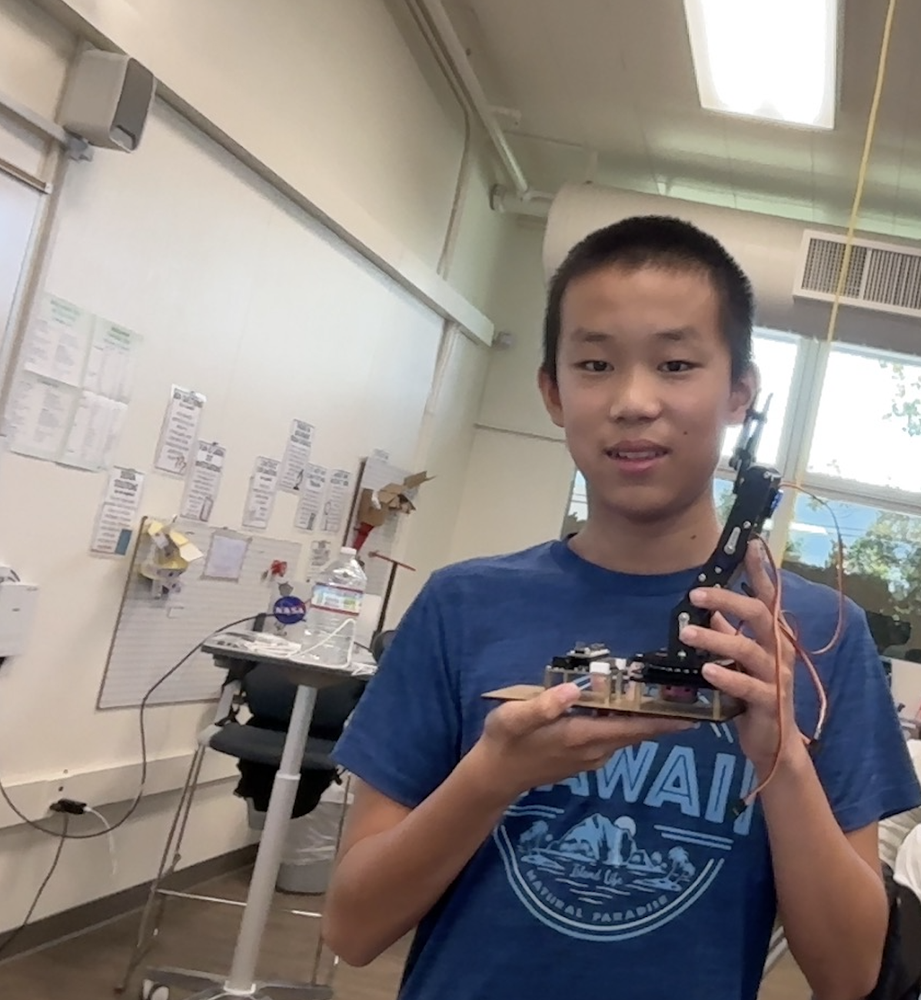

# BlueStamp Robotics Arm
This project is related to the robotic arm.

| **Engineer** | **School** | **Area of Interest** | **Grade** |
|:--:|:--:|:--:|:--:|
|Nathan G| The Kings Academy| Electrical Engineering | Incoming 8th Grader



  
<!---
# Final Milestone

**Don't forget to replace the text below with the embedding for your milestone video. Go to Youtube, click Share -> Embed, and copy and paste the code to replace what's below.**

<iframe width="560" height="315" src="https://www.youtube.com/embed/F7M7imOVGug" title="YouTube video player" frameborder="0" allow="accelerometer; autoplay; clipboard-write; encrypted-media; gyroscope; picture-in-picture; web-share" allowfullscreen></iframe>

For your final milestone, explain the outcome of your project. Key details to include are:
- What you've accomplished since your previous milestone
- What your biggest challenges and triumphs were at BSE
- A summary of key topics you learned about
- What you hope to learn in the future after everything you've learned at BSE


# Second Milestone

**Don't forget to replace the text below with the embedding for your milestone video. Go to Youtube, click Share -> Embed, and copy and paste the code to replace what's below.**

<iframe width="560" height="315" src="https://www.youtube.com/embed/y3VAmNlER5Y" title="YouTube video player" frameborder="0" allow="accelerometer; autoplay; clipboard-write; encrypted-media; gyroscope; picture-in-picture; web-share" allowfullscreen></iframe>

For your second milestone, explain what you've worked on since your previous milestone. You can highlight:
- Technical details of what you've accomplished and how they contribute to the final goal
- What has been surprising about the project so far
- Previous challenges you faced that you overcame
- What needs to be completed before your final milestone

-->

# First Milestone

<iframe width="560" height="315" src="https://www.youtube.com/embed/YOQNgFCrLzI?si=QwGYa4IaQuoOh7v0" title="YouTube video player" frameborder="0" allow="accelerometer; autoplay; clipboard-write; encrypted-media; gyroscope; picture-in-picture; web-share" referrerpolicy="strict-origin-when-cross-origin" allowfullscreen></iframe>

So far, I have intergrated my joysticks and servos so that they worked together. I have done the code to test out my servos and joystick and to make sure that it works. Challenges I faced were how to connect the code of the joystick with the joystick position and then to the servo port. Other diffulicties for me as my first time programming is what to put in the void setup, (define key terms and set the program up etc.), as well as what to put in the void loop, (the actual part that runs the code). Things I learned include how to set my servo as myservo and how to define terms and ports. I also learned the delay variable and the myservo.write(pos), which helps with spinning the servo. Lastly, learned how to apply the joystick position to the code and for the servo to move with the if statement. For example, if servo position is over 600 degrees, move clockwise 180 degrees. Testing the servo and joystick could help me with coding my arm and my modifications. My plan is to finish my second milestone by Thursday, which requires building the hardware of the robot. I will try to finish my third milestone, which is coding, by next Tuesday and finish my modification before Demo night.

# Starter Project Milestone

<iframe width="560" height="315" src="https://www.youtube.com/embed/KaO6494poDA?si=Dcq0TE6nbwQL6Ol9" title="YouTube video player" frameborder="0" allow="accelerometer; autoplay; clipboard-write; encrypted-media; gyroscope; picture-in-picture; web-share" referrerpolicy="strict-origin-when-cross-origin" allowfullscreen></iframe>

For the starter, I soldered the LED and slidersinto different ports. When the slider is moved up (when connected with the cable), the LED lets out more lights, making different colors. 3 sliders make the colors red, green, and blue, and two colors could connect to make other colors such as brown, yellow, and light blue. THe more you move the sliders ,the more color is emmited from the cable, thus giving brighter colors. This project has taught me to keep trying and to put more effort in building. Challenges I faced were how to solder, since I may have added too much or too little amounts of solder, and I had to desolder a couple of times. Challenges I would face in the future is building. Building would be difficult becasue I would need to be careful and not lose pieces of screws and nuts.  My plan for my Robot Arm project is to first make sure that the servos and joysticks work, finish the hardware, finish coding, and finish the modifications. 

<!---
# Schematics 
Here's where you'll put images of your schematics. [Tinkercad](https://www.tinkercad.com/blog/official-guide-to-tinkercad-circuits) and [Fritzing](https://fritzing.org/learning/) are both great resoruces to create professional schematic diagrams, though BSE recommends Tinkercad becuase it can be done easily and for free in the browser. 

# Code
Here's where you'll put your code. The syntax below places it into a block of code. Follow the guide [here]([url](https://www.markdownguide.org/extended-syntax/)) to learn how to customize it to your project needs. 

```c++
void setup() {
  // put your setup code here, to run once:
  Serial.begin(9600);
  Serial.println("Hello World!");
}

void loop() {
  // put your main code here, to run repeatedly:

}
```
-->

# Bill of Materials

| **Part** | **Note** | **Price** | **Link** |
|:--:|:--:|:--:|:--:|
| Cokoino Robotic Arm Kit | It is the kit with all of the materials | $49.99 | <a href="https://www.amazon.com/LK-COKOINO-Compliment-Engineering-Technology/dp/B081FG1JQ1/ref=sr_1_2?crid=2P0244CI0YDK2&dib=eyJ2IjoiMSJ9.gcjv3cdLr95DY2kRWPo6nHH23c4J0NUyjsREXptQDlo.S3aIHrUHSlXeFcWaqggH78oDUJVAXt0N8GmpUktK4HU&dib_tag=se&keywords=lk+cokoino+robotic+arm&qid=1720730123&sprefix=cokoino%2Caps%2C147&sr=8-2"> Link </a> |

<!---
# Other Resources/Examples
One of the best parts about Github is that you can view how other people set up their own work. Here are some past BSE portfolios that are awesome examples. You can view how they set up their portfolio, and you can view their index.md files to understand how they implemented different portfolio components.
- [Example 1](https://trashytuber.github.io/YimingJiaBlueStamp/)
- [Example 2](https://sviatil0.github.io/Sviatoslav_BSE/)
- [Example 3](https://arneshkumar.github.io/arneshbluestamp/)
-->


# Starter Project Milestone


<iframe width="560" height="315" src="https://www.youtube.com/embed/KaO6494poDA?si=Dcq0TE6nbwQL6Ol9" title="YouTube video player" frameborder="0" allow="accelerometer; autoplay; clipboard-write; encrypted-media; gyroscope; picture-in-picture; web-share" referrerpolicy="strict-origin-when-cross-origin" allowfullscreen></iframe>

For the starter, I soldered the LED and slidersinto different ports. When the slider is moved up (when connected with the cable), the LED lets out more lights, making different colors. 3 sliders make the colors red, green, and blue, and two colors could connect to make other colors such as brown, yellow, and light blue. THe more you move the sliders ,the more color is emmited from the cable, thus giving brighter colors. This project has taught me to keep trying and to put more effort in building. Challenges I faced were how to solder, since I may have added too much or too little amounts of solder, and I had to desolder a couple of times. Challenges I would face in the future is building. Building would be difficult becasue I would need to be careful and not lose pieces of screws and nuts.  My plan for my Robot Arm project is to first make sure that the servos and joysticks work, finish the hardware, finish coding, and finish the modifications. 

